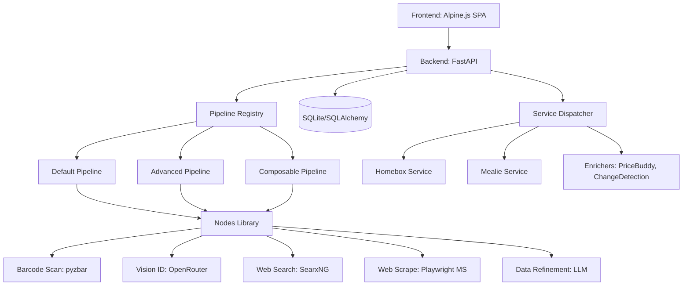
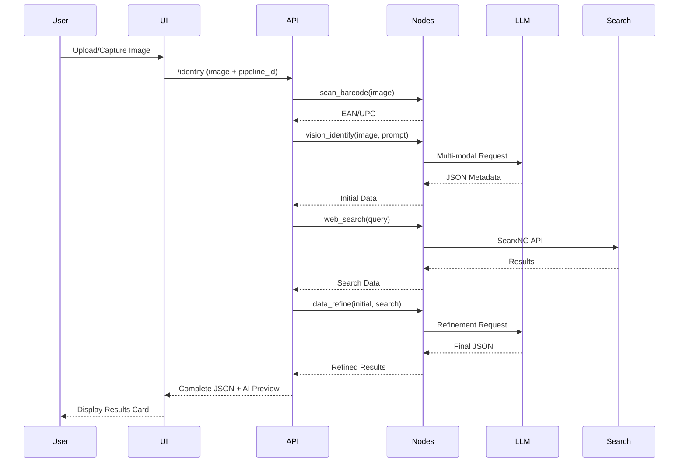
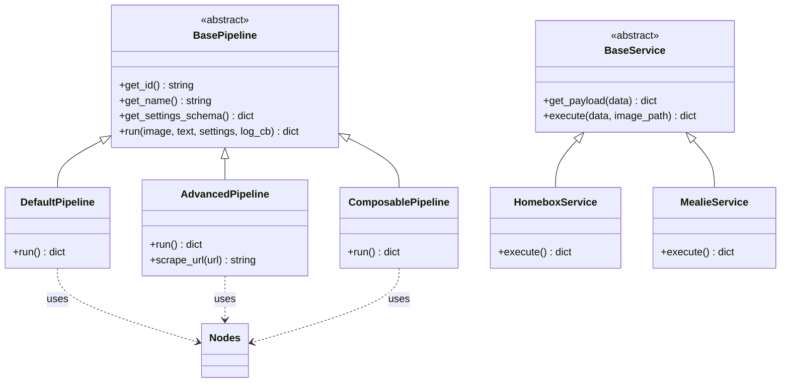
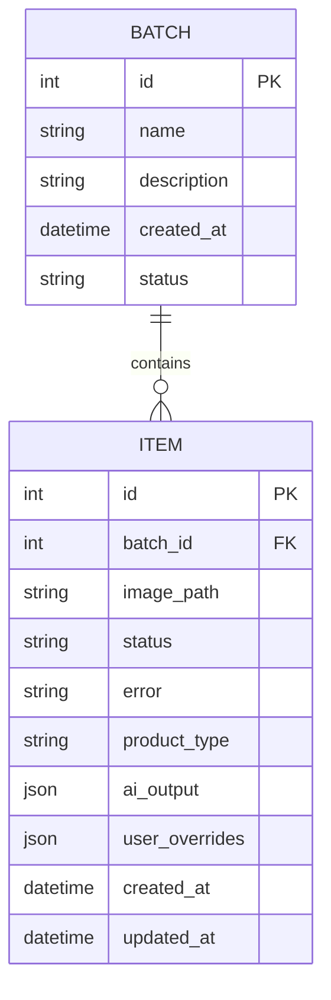

# Vision Pipeline Architecture

The Vision Pipeline is a modular, multi-stage identification and enrichment system designed to integrate physical items with digital home services. It follows a **Node-Based Pipeline** architecture, where complex workflows are composed of discrete functional blocks.

## System Overview

[View interactive diagram on Mermaid.live](https://mermaid.live/edit#base64:eyJjb2RlIjogImdyYXBoIFREXG4gICAgVUlbRnJvbnRlbmQ6IEFscGluZS5qcyBTUEFdIC0tPiBBUElbQmFja2VuZDogRmFzdEFQSV1cbiAgICBBUEkgLS0-IFBSW1BpcGVsaW5lIFJlZ2lzdHJ5XVxuICAgIFBSIC0tPiBEUFtEZWZhdWx0IFBpcGVsaW5lXVxuICAgIFBSIC0tPiBBUFtBZHZhbmNlZCBQaXBlbGluZV1cbiAgICBQUiAtLT4gQ1BbQ29tcG9zYWJsZSBQaXBlbGluZV1cbiAgICBcbiAgICBEUCAtLT4gTkJbTm9kZXMgTGlicmFyeV1cbiAgICBBUCAtLT4gTkJcbiAgICBDUCAtLT4gTkJcbiAgICBcbiAgICBOQiAtLT4gQmFyY29kZVtCYXJjb2RlIFNjYW46IHB5emJhcl1cbiAgICBOQiAtLT4gVmlzaW9uW1Zpc2lvbiBJRDogT3BlblJvdXRlcl1cbiAgICBOQiAtLT4gU2VhcmNoW1dlYiBTZWFyY2g6IFNlYXJ4TkddXG4gICAgTkIgLS0-IFNjcmFwZVtXZWIgU2NyYXBlOiBQbGF5d3JpZ2h0IE1TXVxuICAgIE5CIC0tPiBSZWZpbmVbRGF0YSBSZWZpbmVtZW50OiBMTE1dXG4gICAgXG4gICAgQVBJIC0tPiBEQlsoU1FMaXRlL1NRTEFsY2hlbXkpXVxuICAgIEFQSSAtLT4gU2VydmljZXNbU2VydmljZSBEaXNwYXRjaGVyXSIsICJtZXJtYWlkIjogeyJ0aGVtZSI6ICJkYXJrIn0sICJ1cGRhdGVFZGl0b3IiOiBmYWxzZSwgImF1dG9TeW5jIjogdHJ1ZSwgInVwZGF0ZURpYWdyYW0iOiB0cnVlfQ==)

## Default Pipeline Flow (Sequence)

This diagram illustrates the step-by-step data flow during a standard identification session.

[View interactive diagram on Mermaid.live](https://mermaid.live/edit#base64:eyJjb2RlIjogInNlcXVlbmNlRGlhZ3JhbVxuICAgIHBhcnRpY2lwYW50IFVzZXJcbiAgICBwYXJ0aWNpcGFudCBVSVxuICAgIHBhcnRpY2lwYW50IEFQSVxuICAgIHBhcnRpY2lwYW50IE5vZGVzXG4gICAgcGFydGljaXBhbnQgTExNXG4gICAgcGFydGljaXBhbnQgU2VhcmNoXG5cbiAgICBVc2VyLT4-VUk6IFVwbG9hZC9DYXB0dXJlIEltYWdlXG4gICAgVUktPj5BUEk6IC9pZGVudGlmeSAoaW1hZ2UgKyBwaXBlbGluZV9pZClcbiAgICBBUEktPj5Ob2Rlczogc2Nhbl9iYXJjb2RlKGltYWdlKVxuICAgIE5vZGVzLS0-PkFQSTogRUFOL1VQQ1xuICAgIEFQSS0-Pk5vZGVzOiB2aXNpb25faWRlbnRpZnkoaW1hZ2UsIHByb21wdClcbiAgICBOb2Rlcy0-PkxMTTogTXVsdGktbW9kYWwgUmVxdWVzdFxuICAgIExMTS0tPj5Ob2RlczogSlNPTiBNZXRhZGF0YVxuICAgIE5vZGVzLS0-PkFQSTogSW5pdGlhbCBEYXRhXG4gICAgQVBJLT4-Tm9kZXM6IHdlYl9zZWFyY2gocXVlcnkpXG4gICAgTm9kZXMtPj5TZWFyY2g6IFNlYXJ4TkcgQVBJXG4gICAgU2VhcmNoLS0-Pk5vZGVzOiBSZXN1bHRzXG4gICAgTm9kZXMtLT4-QVBJOiBTZWFyY2ggRGF0YVxuICAgIEFQSS0-Pk5vZGVzOiBkYXRhX3JlZmluZShpbml0aWFsLCBzZWFyY2gpXG4gICAgTm9kZXMtPj5MTE06IFJlZmluZW1lbnQgUmVxdWVzdFxuICAgIExMTS0tPj5Ob2RlczogRmluYWwgSlNPTlxuICAgIE5vZGVzLS0-PkFQSTogUmVmaW5lZCBSZXN1bHRzXG4gICAgQVBJLS0-PlVJOiBDb21wbGV0ZSBKU09OICsgQUkgUHJldmlld1xuICAgIFVJLS0-PlVzZXI6IERpc3BsYXkgUmVzdWx0cyBDYXJkIiwgIm1lcm1haWQiOiB7InRoZW1lIjogImRhcmsifSwgInVwZGF0ZUVkaXRvciI6IGZhbHNlLCAiYXV0b1N5bmMiOiB0cnVlLCAidXBkYXRlRGlhZ3JhbSI6IHRydWV9)

## Software Architecture (Class Structure)

The backend follows a registry pattern for pipelines and services.

[View interactive diagram on Mermaid.live](https://mermaid.live/edit#base64:eyJjb2RlIjogImNsYXNzRGlhZ3JhbVxuICAgIGNsYXNzIEJhc2VQaXBlbGluZSB7XG4gICAgICAgIDw8YWJzdHJhY3Q-PlxuICAgICAgICArZ2V0X2lkKCkgc3RyaW5nXG4gICAgICAgICtnZXRfbmFtZSgpIHN0cmluZ1xuICAgICAgICArZ2V0X3NldHRpbmdzX3NjaGVtYSgpIGRpY3RcbiAgICAgICAgK3J1bihpbWFnZSwgdGV4dCwgc2V0dGluZ3MsIGxvZ19jYikgZGljdFxuICAgIH1cbiAgICBjbGFzcyBEZWZhdWx0UGlwZWxpbmUge1xuICAgICAgICArcnVuKCkgZGljdFxuICAgIH1cbiAgICBjbGFzcyBBZHZhbmNlZFBpcGVsaW5lIHtcbiAgICAgICAgK3J1bigpIGRpY3RcbiAgICAgICAgK3NjcmFwZV91cmwodXJsKSBzdHJpbmdcbiAgICB9XG4gICAgY2xhc3MgQ29tcG9zYWJsZVBpcGVsaW5lIHtcbiAgICAgICAgK3J1bigpIGRpY3RcbiAgICB9XG4gICAgY2xhc3MgQmFzZVNlcnZpY2Uge1xuICAgICAgICA8PGFic3RyYWN0Pj5cbiAgICAgICAgK2dldF9wYXlsb2FkKGRhdGEpIGRpY3RcbiAgICAgICAg2V4ZWN1dGUoZGF0YSwgaW1hZ2VfcGF0aCkgZGljdFxuICAgIH1cbiAgICBjbGFzcyBIb21lYm94U2VydmljZSB7XG4gICAgICAgICtleGVjdXRlKCkgZGljdFxuICAgIH1cbiAgICBjbGFzcyBNZWFsaWVTZXJ2aWNlIHtcbiAgICAgICAgK2V4ZWN1dGUoKSBkaWN0XG4gICAgfVxuXG4gICAgQmFzZVBpcGVsaW5lIDx8LS0gRGVmYXVsdFBpcGVsaW5lXG4gICAgQmFzZVBpcGVsaW5lIDx8LS0gQWR2YW5jZWRQaXBlbGluZVxuICAgIEJhc2VQaXBlbGluZSA8fC0tIENvbXBvc2FibGVQaXBlbGluZVxuICAgIEJhc2VTZXJ2aWNlIDx8LS0gSG9tZWJveFNlcnZpY2VcbiAgICBCYXNlU2VydmljZSA8fC0tIE1lYWxpZVNlcnZpY2VcbiAgICBcbiAgICBEZWZhdWx0UGlwZWxpbmUgLi4-IE5vZGVzIDogdXNlc1xuICAgIEFkdmFuY2VkUGlwZWxpbmUgLi4-IE5vZGVzIDogdXNlc1xuICAgIENvbXBvc2FibGVQaXBlbGluZSAuLj4gTm9kZXMgOiB1c2VzIiwgIm1lcm1haWQiOiB7InRoZW1lIjogImRhcmsifSwgInVwZGF0ZUVkaXRvciI6IGZhbHNlLCAiYXV0b1N5bmMiOiB0cnVlLCAidXBkYXRlRGlhZ3JhbSI6IHRydWV9)

## Data Models (ER Diagram)

The system uses SQLite (via SQLAlchemy) to track processing batches and items.

[View interactive diagram on Mermaid.live](https://mermaid.live/edit#base64:eyJjb2RlIjogImVyRGlhZ3JhbVxuICAgIEJBVENIIHx8LS1veyBJVEVNIDogY29udGFpbnNcbiAgICBCQVRDSCB7XG4gICAgICAgIGludCBpZCBQS1xuICAgICAgICBzdHJpbmcgbmFtZVxuICAgICAgICBzdHJpbmcgZGVzY3JpcHRpb25cbiAgICAgICAgZGF0ZXRpbWUgY3JlYXRlZF9hdFxuICAgICAgICBzdHJpbmcgc3RhdHVzXG4gICAgfVxuICAgIElURU0ge1xuICAgICAgICBpbnQgaWQgUEtcbiAgICAgICAgaW50IGJhdGNoX2lkIEZLXG4gICAgICAgIHN0cmluZyBpbWFnZV9wYXRoXG4gICAgICAgIHN0cmluZyBzdGF0dXNcbiAgICAgICAgc3RyaW5nIGVycm9yXG4gICAgICAgIHN0cmluZyBwcm9kdWN0X3R5cGVcbiAgICAgICAganNvbiBhaV9vdXRwdXRcbiAgICAgICAganNvbiB1c2VyX292ZXJyaWRlc1xuICAgICAgICBkYXRldGltZSBjcmVhdGVkX2F0XG4gIC2RhdGV0aW1lIHVwZGF0ZWRfYXRcbiAgICB9IiwgIm1lcm1haWQiOiB7InRoZW1lIjogImRhcmsifSwgInVwZGF0ZUVkaXRvciI6IGZhbHNlLCAiYXV0b1N5bmMiOiB0cnVlLCAidXBkYXRlRGlhZ3JhbSI6IHRydWV9)

## Core Components

### 1. Frontend (SPA)
Built with **Alpine.js** and **Tailwind CSS**, the frontend provides:
- **Freehand Lasso Tool**: A custom HTML5 Canvas implementation that generates transparent image masks.
- **Dynamic Pipeline Settings**: Real-time configuration of pipeline nodes, prompts, and model selection.
- **Pre-flight Payload Preview**: Intercepts service execution to allow manual editing of JSON data before API submission.

### 2. Backend (FastAPI)
The backend manages:
- **Pipeline Execution**: Orchestrates the sequential execution of nodes.
- **Background Tasks**: Handles batch uploads and long-running identification processes.
- **Service Integration**: A modular registry of external service wrappers.

### 3. Pipeline Registry
Pipelines are defined as Python classes in `src/pipelines/`.
- `BasePipeline`: The abstract base class defining the contract.
- `DefaultPipeline`: The standard 4-stage identification workflow.
- `AdvancedPipeline`: Includes Playwright-based web scraping for deep enrichment.
- `ComposablePipeline`: Allows users to define their own node sequence via the UI.

### 4. Nodes Library (`nodes.py`)
Atomic functional units that can be reused across any pipeline.
- **Barcode**: High-fidelity multi-pass scanning.
- **Vision**: Multi-modal LLM identification.
- **Search**: Meta-search via SearxNG.
- **Scrape**: Stealth scraping via the Playwright Microservice.
- **Refine**: Logical merging and refinement of data points.

### 5. Playwright Microservice
A separate container running a Playwright browser instance with stealth extensions, accessible via a lightweight FastAPI wrapper. This ensures the main app container remains lean and stable.
